# 🏗️ AI Financial Agent — System Architecture

> A visual, diagram-heavy guide to every layer of the platform.
> Designed to be understandable even if you're new to software architecture.

---

## What Is "Architecture"?

Architecture is like a blueprint of a building. It shows:
- **What parts** the system has (frontend, backend, database, AI)
- **How they connect** to each other (HTTP, SQL, file system)
- **What flows through** each connection (JSON data, files, tokens)

---

## 1. 🌐 High-Level System Overview

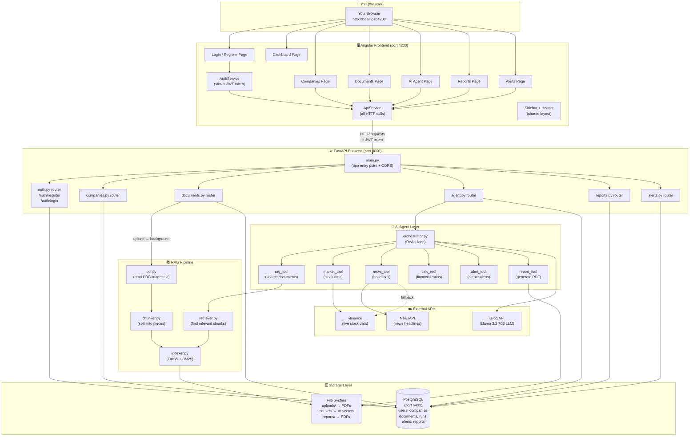

---

## 2. 🔐 Authentication Flow

How login works from your click to getting a JWT:

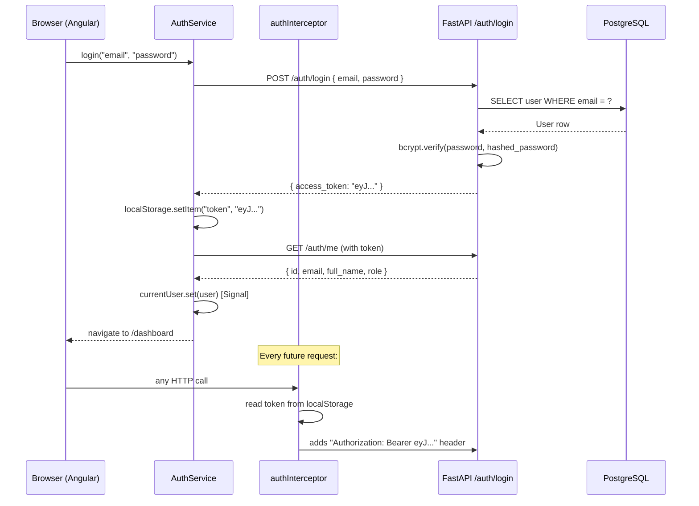

---

## 3. 📤 Document Upload & Processing Pipeline

What happens from the moment you click "Upload" to status = "ready":

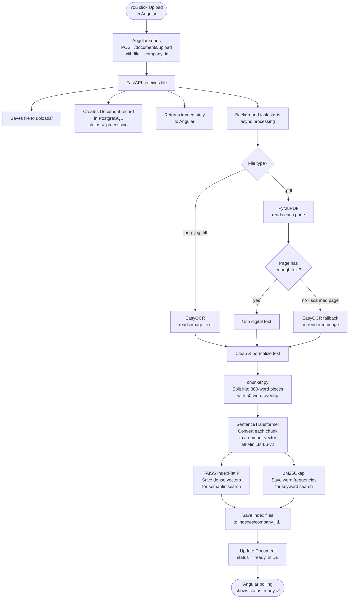

---

## 4. 🔍 RAG Retrieval Pipeline

When the AI agent needs to search your documents:

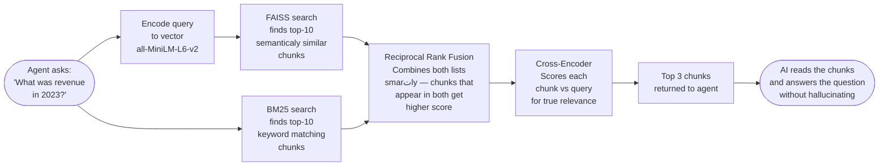

> **Why two search methods?**
> - **FAISS (semantic)** understands meaning — "profit" matches "earnings" even without the same word
> - **BM25 (keyword)** finds exact matches — great for specific numbers, dates, names
> - **Together** they catch more relevant text than either alone

---

## 5. 🤖 ReAct Agent Loop

The AI "thinks" in steps, calling tools between each thought:

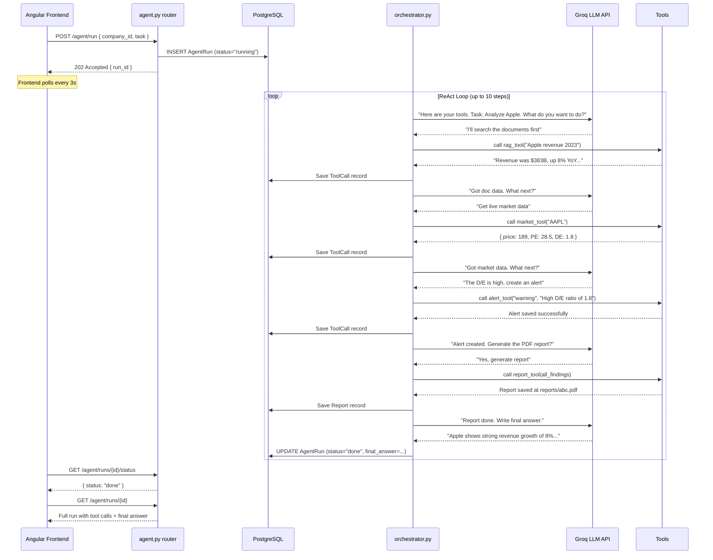

---

## 6. 🗄️ Database Schema (Entity Relationship)

How all the tables relate to each other:

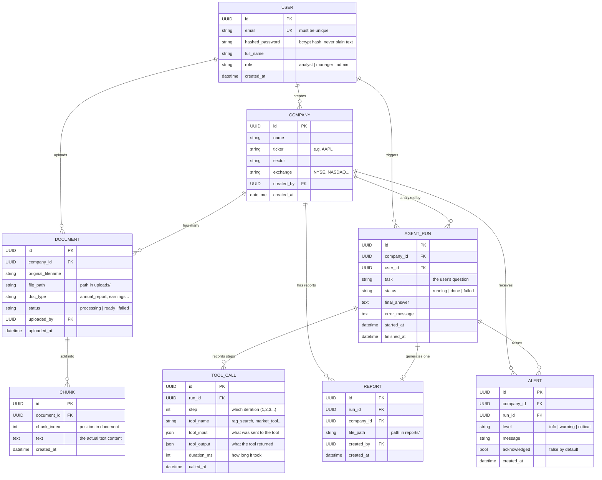

---

## 7. 🖥️ Angular Frontend Architecture

How the Angular app is structured:

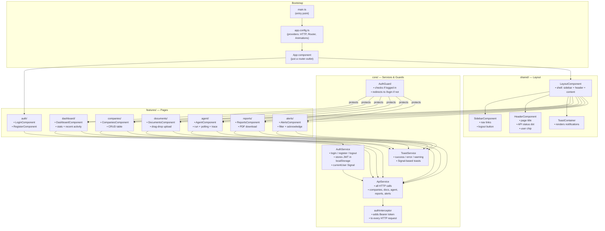

---

## 8. 🔒 Security Architecture

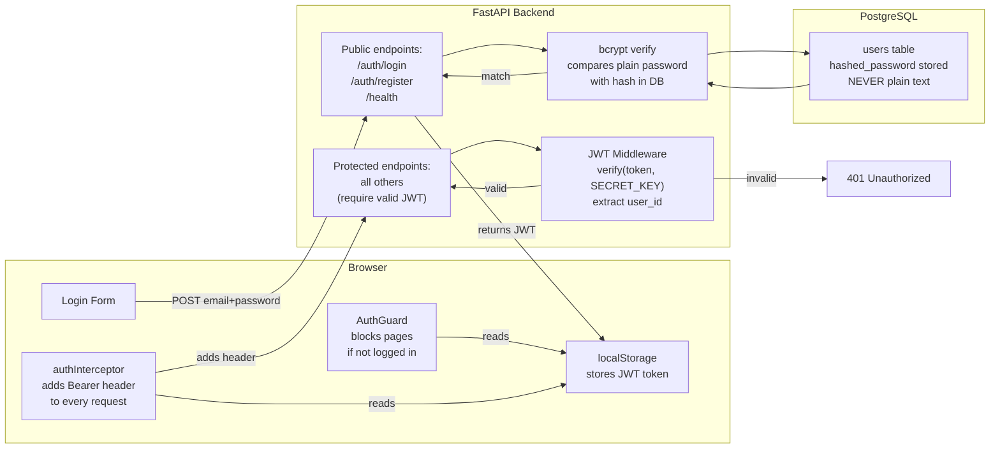

---

## 9. 🌐 API Endpoint Map

Every URL the backend exposes:

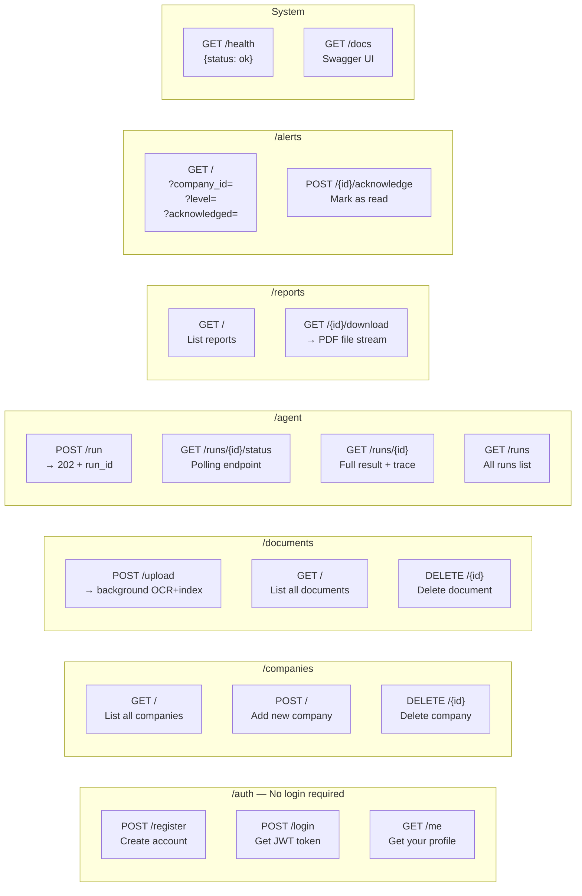

---

## 10. 📊 Data Flow: Adding a Company (Simple Example)

Tracing one simple operation end-to-end:

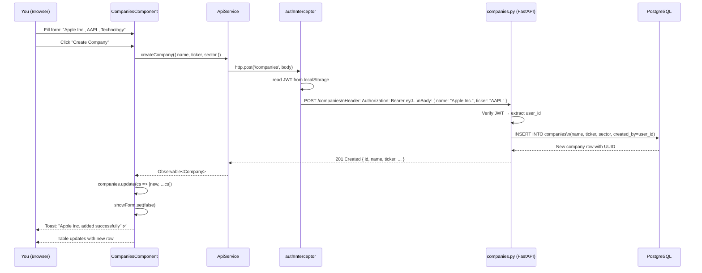

---

## 11. 📁 Complete File Tree with Roles

```
financial-agent/
│
│  ← ROOT CONFIG FILES
├── .env                    ← Runtime secrets (NEVER commit to git)
├── .env.example            ← Template showing what .env needs
├── requirements.txt        ← Python package list
├── alembic.ini             ← Database migration config
├── docker-compose.yml      ← Multi-container startup config
├── Dockerfile              ← Backend container build instructions
├── evaluate.py             ← RAGAS quality evaluation script
│
│  ← BACKEND (Python/FastAPI)
├── backend/
│   ├── main.py             ← Server entry point + CORS + router mounting
│   ├── config.py           ← Reads .env into typed settings object
│   ├── database.py         ← PostgreSQL async connection setup
│   │
│   ├── models/             ← Database table definitions (SQLAlchemy ORM)
│   │   ├── user.py         ← users table
│   │   ├── company.py      ← companies table
│   │   ├── document.py     ← documents table
│   │   ├── chunk.py        ← chunks table (RAG text pieces)
│   │   ├── agent_run.py    ← agent_runs table
│   │   ├── tool_call.py    ← tool_calls table (AI step log)
│   │   ├── report.py       ← reports table
│   │   └── alert.py        ← alerts table
│   │
│   ├── schemas/            ← Request/response data shapes (Pydantic)
│   │   ├── user.py         ← LoginRequest, UserCreate, UserResponse, TokenResponse
│   │   ├── company.py      ← CompanyCreate, CompanyResponse
│   │   ├── document.py     ← DocumentResponse
│   │   ├── agent.py        ← AgentRunRequest, AgentRunResponse, RunStatus
│   │   ├── report.py       ← ReportResponse
│   │   └── alert.py        ← AlertResponse
│   │
│   ├── routers/            ← API endpoint handlers
│   │   ├── auth.py         ← /auth/register, /auth/login, /auth/me
│   │   ├── companies.py    ← GET/POST/DELETE /companies
│   │   ├── documents.py    ← POST /documents/upload, GET/DELETE /documents
│   │   ├── agent.py        ← POST /agent/run, GET /agent/runs/{id}
│   │   ├── reports.py      ← GET /reports, GET /reports/{id}/download
│   │   └── alerts.py       ← GET /alerts, POST /alerts/{id}/acknowledge
│   │
│   ├── services/           ← Reusable business logic
│   │   ├── auth_service.py     ← JWT create/verify, bcrypt hash/verify
│   │   └── document_service.py ← Full OCR→chunk→index pipeline
│   │
│   ├── agent/              ← AI agent implementation
│   │   ├── orchestrator.py ← ReAct loop (think → act → think → act...)
│   │   ├── prompts.py      ← System prompt for the AI
│   │   └── tools/
│   │       ├── rag_tool.py     ← Searches uploaded documents
│   │       ├── market_tool.py  ← Gets live stock data (yfinance)
│   │       ├── news_tool.py    ← Gets news articles (NewsAPI + yfinance)
│   │       ├── calc_tool.py    ← Calculates financial ratios
│   │       ├── alert_tool.py   ← Creates and saves risk alerts
│   │       └── report_tool.py  ← Generates PDF reports (ReportLab)
│   │
│   └── rag/                ← Document search pipeline
│       ├── ocr.py          ← Extracts text from PDFs and images
│       ├── chunker.py      ← Splits text into 300-word pieces
│       ├── indexer.py      ← Builds FAISS (dense) + BM25 (sparse) index
│       └── retriever.py    ← Finds most relevant chunks for a query
│
│  ← DATABASE MIGRATIONS
├── alembic/
│   └── versions/           ← Migration scripts (one per schema change)
│
│  ← ANGULAR FRONTEND (TypeScript)
├── angular-frontend/
│   ├── angular.json        ← Angular build configuration (zone.js, styles, etc.)
│   ├── package.json        ← Node.js dependencies list
│   ├── tsconfig.json       ← TypeScript compiler settings
│   └── src/
│       ├── index.html      ← Single HTML file (Angular renders inside <app-root>)
│       ├── main.ts         ← Angular bootstrap entry point
│       ├── styles.scss     ← Global dark theme styles and design tokens
│       ├── environments/
│       │   ├── environment.ts       ← Dev: apiUrl = localhost:8000
│       │   └── environment.prod.ts  ← Prod: apiUrl = your server URL
│       └── app/
│           ├── app.ts          ← Root component (just <router-outlet>)
│           ├── app.config.ts   ← Wires HTTP, Router, Interceptors, Animations
│           ├── app.routes.ts   ← URL-to-component mapping
│           │
│           ├── core/                ← Foundation (services, guards, interceptors)
│           │   ├── models/index.ts  ← TypeScript types matching backend JSON
│           │   ├── services/
│           │   │   ├── auth.service.ts   ← Login/logout/JWT/currentUser
│           │   │   ├── api.service.ts    ← All backend HTTP calls
│           │   │   └── toast.service.ts  ← Pop-up notifications
│           │   ├── guards/
│           │   │   └── auth.guard.ts     ← Redirect to login if not authenticated
│           │   └── interceptors/
│           │       └── auth.interceptor.ts ← Auto-adds JWT header
│           │
│           ├── shared/              ← Reusable layout components
│           │   ├── layout/layout.component.ts        ← Page shell
│           │   ├── sidebar/sidebar.component.ts       ← Left navigation
│           │   ├── header/header.component.ts         ← Top bar
│           │   ├── toast-container/                   ← Toast renderer
│           │   └── pipes/replace.pipe.ts              ← String helper pipe
│           │
│           └── features/            ← Page components (one per route)
│               ├── auth/
│               │   ├── auth.routes.ts             ← /auth/login & /auth/register routes
│               │   ├── login/login.component.ts   ← Login form
│               │   └── register/register.component.ts ← Register form
│               ├── dashboard/dashboard.component.ts   ← Home stats page
│               ├── companies/companies.component.ts   ← Company CRUD
│               ├── documents/documents.component.ts   ← Document upload
│               ├── agent/agent.component.ts           ← AI agent runner
│               ├── reports/reports.component.ts       ← PDF downloads
│               └── alerts/alerts.component.ts         ← Risk alerts
│
│  ← RUNTIME DATA (auto-created, ignored by git)
├── uploads/            ← Raw uploaded files (PDFs, images)
├── indexes/            ← FAISS vector files + BM25 pickle files per company
├── reports/            ← Generated PDF report files
└── evaluation_results/ ← RAGAS evaluation output (CSV, JSON, charts)
```

---

## 12. 🧪 RAGAS Evaluation Pipeline

How we measure AI answer quality:

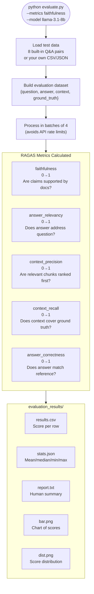

---

## 13. 🐳 Deployment Architecture

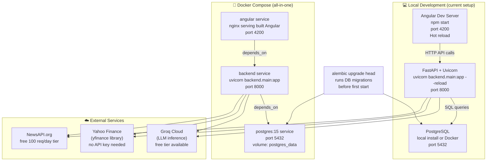

---

## 14. 🧩 Technology Choice Rationale

| Decision | Technology Chosen | Why |
|---|---|---|
| AI/LLM | Groq + Llama 3.3 70B | Very fast inference, free tier, tool-calling support |
| Web framework | FastAPI | Async, auto-docs, Pydantic integration |
| Database | PostgreSQL | ACID-compliant, UUID support, async drivers |
| Vector search | FAISS | Extremely fast, runs locally (no cloud needed) |
| OCR | PyMuPDF + EasyOCR | PyMuPDF for digital PDFs, EasyOCR for scanned |
| Frontend framework | Angular 21 | Production-grade, standalone components, signals |
| Embedding model | all-MiniLM-L6-v2 | Fast, good quality, runs on CPU |
| PDF generation | ReportLab | Full control over layout, pure Python |
| Market data | yfinance | Free, no API key, comprehensive |
